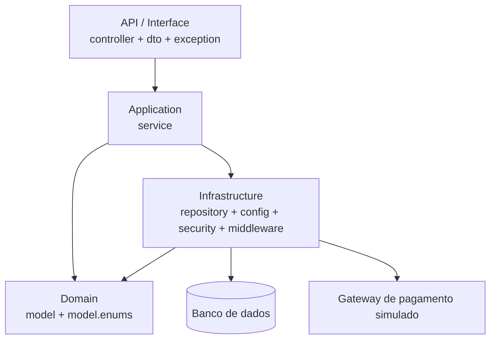

# Arquitetura da solução

A API segue uma organização em camadas (MVC em camadas do Spring Boot), com separação explícita
de responsabilidades. Cada pacote corresponde a uma das camadas exigidas pelo roteiro.

| Camada | Pacote | Responsabilidade |
| --- | --- | --- |
| API (Interface) | `controller`, `dto`, `exception` | Rotas REST, contratos de request/response, validação de entrada, documentação OpenAPI e padronização de erros |
| Application | `service` | Casos de uso e orquestração: criar pedido, aplicar fidelidade, confirmar pagamento mock, atualizar status, auditar |
| Domain | `model`, `model.enums` | Entidades e estados do negócio (Pedido, Cliente, Produto, EstoqueItem, StatusPedido, CanalAtendimento) |
| Infrastructure | `repository`, `config`, `security`, `middleware` | Persistência JPA, carga inicial (seed), autenticação JWT, autorização por perfil e trilha de acessos |

## Decisões relevantes

- **Autenticação stateless com JWT (HS256)**: `JwtService` emite o token no login e
  `JwtAuthenticationFilter` popula o `SecurityContext` a cada requisição, sem sessão no servidor.
- **Senhas com BCrypt**: apenas o hash é persistido em `usuarios.senha_hash`.
- **Erro padronizado**: `GlobalExceptionHandler` converte exceções de domínio
  (`NotFoundException` → 404, `BusinessRuleException` → 409, `ValidationException` → 422)
  para um único formato JSON, e `RestAuthenticationEntryPoint`/`RestAccessDeniedHandler`
  aplicam o mesmo formato aos 401/403 gerados pelo Spring Security.
- **Pagamento simulado**: o fluxo de gateway externo é representado por dois endpoints
  (solicitar/confirmar) e pela referência `MOCK-<uuid>`, sem integração com provedor real.
- **Auditoria**: `AuditService` registra ações sensíveis e `AccessAuditFilter` registra as
  requisições HTTP com usuário autenticado, método, rota, status e duração.
