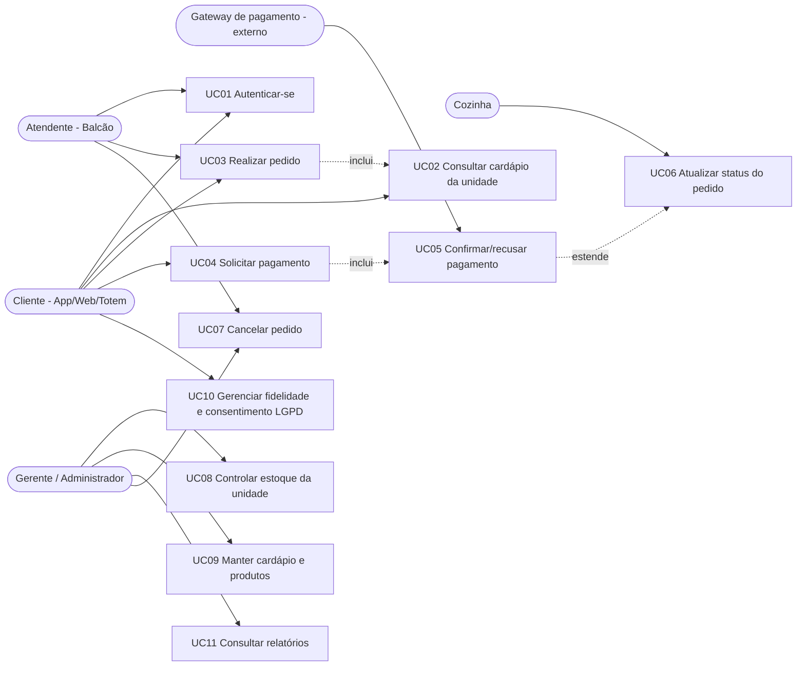

# Diagrama de casos de uso

## Descrição da feature crítica: Realizar Pedido + Solicitar Pagamento

**Atores:** Cliente (App/Totem/Web) ou Atendente; Gateway de pagamento (mock).

**Pré-condições**
- Usuário autenticado com token JWT válido.
- Unidade cadastrada e produto vinculado ao cardápio da unidade com `disponivel = true`.
- Estoque do produto na unidade maior ou igual à quantidade pedida.

**Fluxo principal**
1. O cliente consulta o cardápio da unidade (`GET /api/unidades/{unidadeId}/produtos`).
2. Envia `POST /api/pedidos` informando `canalPedido`, `unidadeId`, `clienteId` (opcional) e `itens`.
3. A API valida o cardápio, a sazonalidade e o estoque de cada item, calcula preço unitário
   (preço da unidade quando houver override) e grava o pedido com status `CRIADO`.
4. O cliente envia `POST /api/pedidos/{id}/pagamento/solicitar`: o pedido passa a
   `AGUARDANDO_PAGAMENTO`, o pagamento externo fica `SOLICITADO` e a API gera a referência `MOCK-<uuid>`.
5. O gateway devolve o resultado em `POST /api/pedidos/{id}/pagamento/confirmar`.
   Aprovado: pedido `PAGO`, baixa de estoque e crédito de pontos de fidelidade.
6. A cozinha evolui o status via `PUT /api/pedidos/{id}/status`
   (`EM_PREPARO` → `PRONTO` → `FINALIZADO`).

**Pós-condições**
- Pedido persistido com itens, totais e histórico em `pedido_eventos`.
- Estoque da unidade decrementado apenas quando o pagamento é aprovado.
- Ações sensíveis registradas em `audit_logs` e requisições em `access_logs`.

**Exceções e regras de negócio**
| Situação | Tratamento |
| --- | --- |
| `canalPedido` ausente ou inválido | `400 Bad Request` com o erro padronizado |
| Unidade, cliente ou produto inexistente | `404 Not Found` |
| Produto fora do cardápio da unidade | `404 Not Found` |
| Produto indisponível ou fora da sazonalidade | `409 Conflict` |
| Estoque insuficiente | `409 Conflict` — o pedido não é confirmado |
| Confirmação antes da solicitação de pagamento | `409 Conflict` |
| Pagamento recusado | Pedido permanece `AGUARDANDO_PAGAMENTO` e estoque intacto |
| Pedido cancelado ou finalizado | Bloqueia novas transições de status (`409 Conflict`) |
| Crédito de pontos sem consentimento LGPD | Pontos não são creditados |
