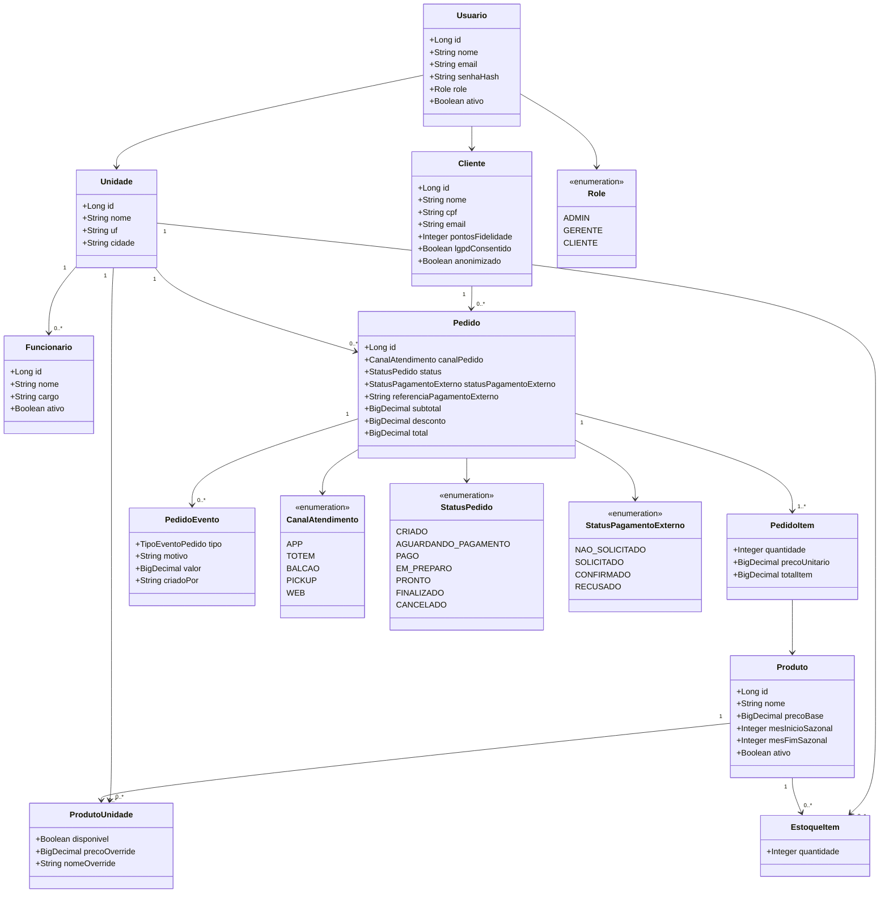
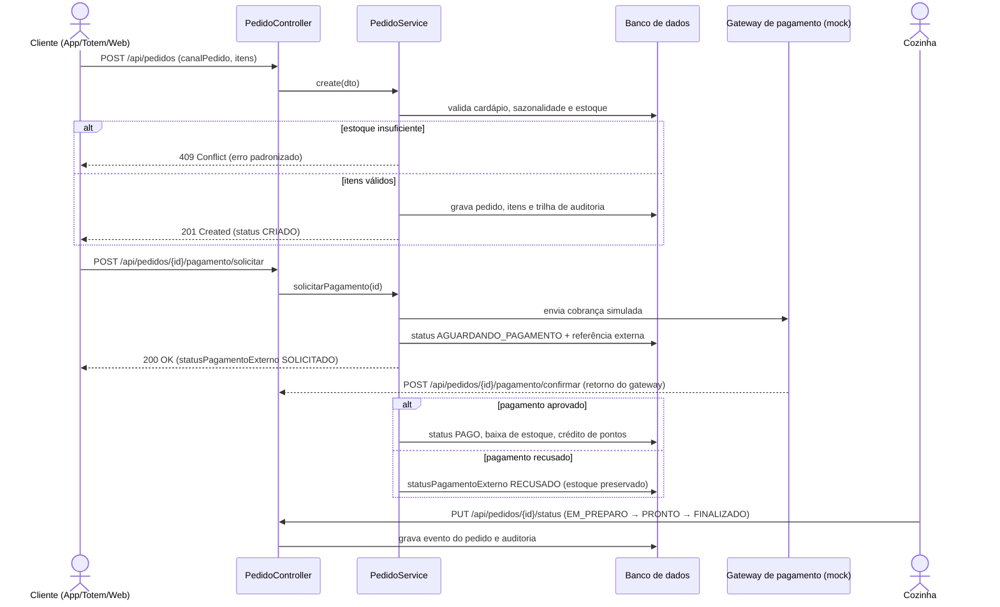

# Diagrama de classes (visão de domínio)

```mermaid
classDiagram
    class Usuario {
        +Long id
        +String nome
        +String email
        +String senhaHash
        +Role role
        +Boolean ativo
    }

    class Cliente {
        +Long id
        +String nome
        +String cpf
        +String email
        +Integer pontosFidelidade
        +Boolean lgpdConsentido
        +Boolean anonimizado
    }

    class Unidade {
        +Long id
        +String nome
        +String uf
        +String cidade
    }

    class Funcionario {
        +Long id
        +String nome
        +String cargo
        +Boolean ativo
    }

    class Produto {
        +Long id
        +String nome
        +BigDecimal precoBase
        +Integer mesInicioSazonal
        +Integer mesFimSazonal
        +Boolean ativo
    }

    class ProdutoUnidade {
        +Boolean disponivel
        +BigDecimal precoOverride
        +String nomeOverride
    }

    class EstoqueItem {
        +Integer quantidade
    }

    class Pedido {
        +Long id
        +CanalAtendimento canalPedido
        +StatusPedido status
        +StatusPagamentoExterno statusPagamentoExterno
        +String referenciaPagamentoExterno
        +BigDecimal subtotal
        +BigDecimal desconto
        +BigDecimal total
    }

    class PedidoItem {
        +Integer quantidade
        +BigDecimal precoUnitario
        +BigDecimal totalItem
    }

    class PedidoEvento {
        +TipoEventoPedido tipo
        +String motivo
        +BigDecimal valor
        +String criadoPor
    }

    class Role {
        <<enumeration>>
        ADMIN
        GERENTE
        CLIENTE
    }

    class CanalAtendimento {
        <<enumeration>>
        APP
        TOTEM
        BALCAO
        PICKUP
        WEB
    }

    class StatusPedido {
        <<enumeration>>
        CRIADO
        AGUARDANDO_PAGAMENTO
        PAGO
        EM_PREPARO
        PRONTO
        FINALIZADO
        CANCELADO
    }

    class StatusPagamentoExterno {
        <<enumeration>>
        NAO_SOLICITADO
        SOLICITADO
        CONFIRMADO
        RECUSADO
    }

    Usuario --> Role
    Usuario --> Unidade
    Usuario --> Cliente
    Cliente "1" --> "0..*" Pedido
    Unidade "1" --> "0..*" Pedido
    Unidade "1" --> "0..*" Funcionario
    Unidade "1" --> "0..*" ProdutoUnidade
    Unidade "1" --> "0..*" EstoqueItem
    Produto "1" --> "0..*" ProdutoUnidade
    Produto "1" --> "0..*" EstoqueItem
    Pedido "1" --> "1..*" PedidoItem
    Pedido "1" --> "0..*" PedidoEvento
    Pedido --> CanalAtendimento
    Pedido --> StatusPedido
    Pedido --> StatusPagamentoExterno
    PedidoItem --> Produto
```

## Sequência do fluxo crítico (Pedido → Pagamento mock → Status)

```mermaid
sequenceDiagram
    actor Cliente as Cliente (App/Totem/Web)
    participant API as PedidoController
    participant SVC as PedidoService
    participant DB as Banco de dados
    participant PAY as Gateway de pagamento (mock)
    actor Cozinha

    Cliente->>API: POST /api/pedidos (canalPedido, itens)
    API->>SVC: create(dto)
    SVC->>DB: valida cardápio, sazonalidade e estoque
    alt estoque insuficiente
        SVC-->>Cliente: 409 Conflict (erro padronizado)
    else itens válidos
        SVC->>DB: grava pedido, itens e trilha de auditoria
        SVC-->>Cliente: 201 Created (status CRIADO)
    end

    Cliente->>API: POST /api/pedidos/{id}/pagamento/solicitar
    API->>SVC: solicitarPagamento(id)
    SVC->>PAY: envia cobrança simulada
    SVC->>DB: status AGUARDANDO_PAGAMENTO + referência externa
    SVC-->>Cliente: 200 OK (statusPagamentoExterno SOLICITADO)

    PAY-->>API: POST /api/pedidos/{id}/pagamento/confirmar (retorno do gateway)
    alt pagamento aprovado
        SVC->>DB: status PAGO, baixa de estoque, crédito de pontos
    else pagamento recusado
        SVC->>DB: statusPagamentoExterno RECUSADO (estoque preservado)
    end

    Cozinha->>API: PUT /api/pedidos/{id}/status (EM_PREPARO → PRONTO → FINALIZADO)
    API->>DB: grava evento do pedido e auditoria
```
