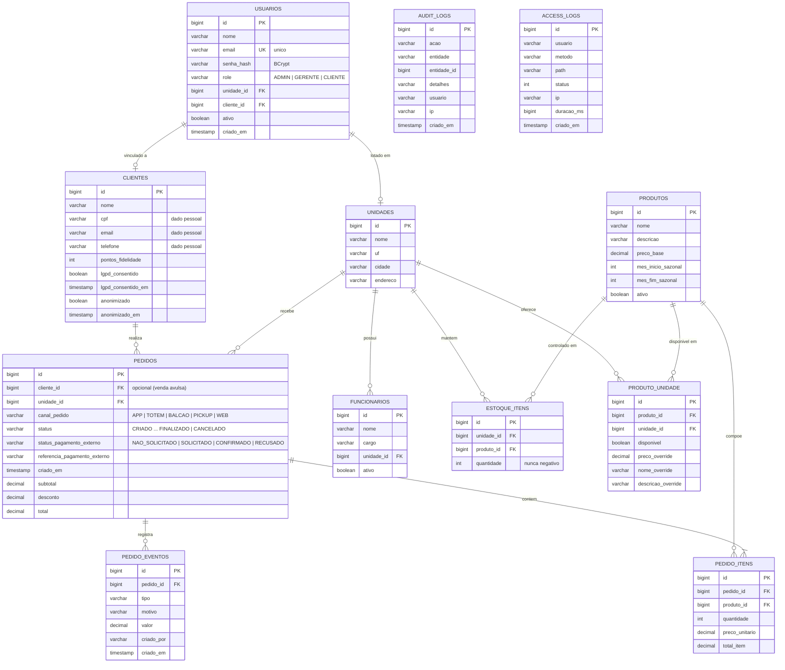

# DER — Modelo de dados

Diagrama entidade-relacionamento das tabelas criadas pelo mapeamento JPA
(compatível com o banco usado pela API: H2 em modo PostgreSQL, e portável para PostgreSQL/MySQL).

`AUDIT_LOGS` e `ACCESS_LOGS` não possuem chave estrangeira: são tabelas de trilha de auditoria,
preservadas mesmo quando o registro de origem é removido ou anonimizado.
